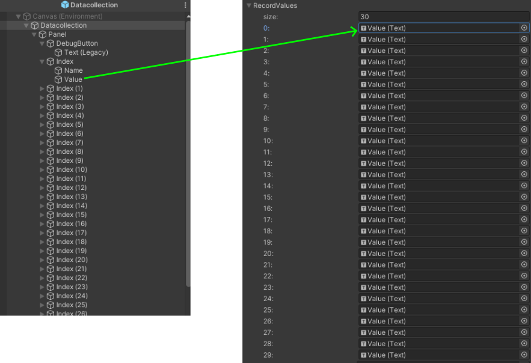

# MVP Lab
At Metaverse Public (MVP) Lab, we view the metaverse as a society and conduct research on interesting phenomena occurring there. We also aim to establish research methods suitable for the metaverse.

# MVP_DTC
Data collection system by MVP Lab

# Requirement
VRChat SDK Ver. 3.6.1 or later
Unity 2022.3.22f1

# How to use
## Prefab set
1. Clone or download this repository.
2. Import the contents of this repository into your Unity project.
3. Put the "Datacollection.prefab" to hierarchy.

<<<<<<< HEAD
## UDON Behaviour
1. Set some VRChat IDs to "Staffnames".
2. Enter the Name (Text) under the Index corresponding to the number of players you want to record in "RecordNames".
3. Enter the Value (Text) under the Index corresponding to the number of players you want to record in "RecordNames".
=======
## UDON Behaviour (Datacollection)
### Main custom
1. Set some VRChat IDs to "Staffnames".
2. Enter the Name (Text) under the Index corresponding to the number of players you want to record in "RecordNames" (max 30 number).
3. Enter the Value (Text) under the Index corresponding to the number of players you want to record in "RecordValues" (max 30 number).
4. Set the button UI on the Agreebutton.
5. Set the RecordAgree event of Data collection UDON Behaviour to the On Click event of the button UI.

### Other variables
|  Name  |  Type  |  Usage  |  Default   |
| ---- | ---- | ---- | ---- |
|  OwnerObject  |  Gameobject  |  Set objects with the UDON Behaviour for “Datacollection” inserted  |  Datacollection  |
|  AgreeButton  |  UIButton  |  Set the UIButton to confirm consent  |  AgreeButton  |
|  IndexText  |  UIText  |  Display the current number of record players  |  CurrentNumber  |
|  MainCanvas  |  Canvas  |  Debug display canvas for Datacollection  |  Datacollection  |
|  ButtonASource  |  AudioSource  |  Audio output source when the consent button is pressed  |  Agreement  |

## Place of log
With the default settings, it will be output to the user folder (Exp. C:\Users\[USER NAME]\AppData\LocalLow\VRChat\VRChat).

The default structure of log data is as follows:

[VRChat ID]: [Index]: [Head angular (yaw, pitch roll)] : [Avatar angular (yaw, pitch roll)] : [AVatar position]: [mm/dd/yyyy HH:MM:SS: milisec]

# Reference
[VRChat内位置情報・アンケート収集解析ツールYAIBAの紹介](https://note.com/cocu_tan/n/n70972d7646bd)
 
[YAIBA-VRC](https://note.com/cocu_tan/n/n70972d7646bd)

# Acknowledgement
This project was supported by MVP Lab.
