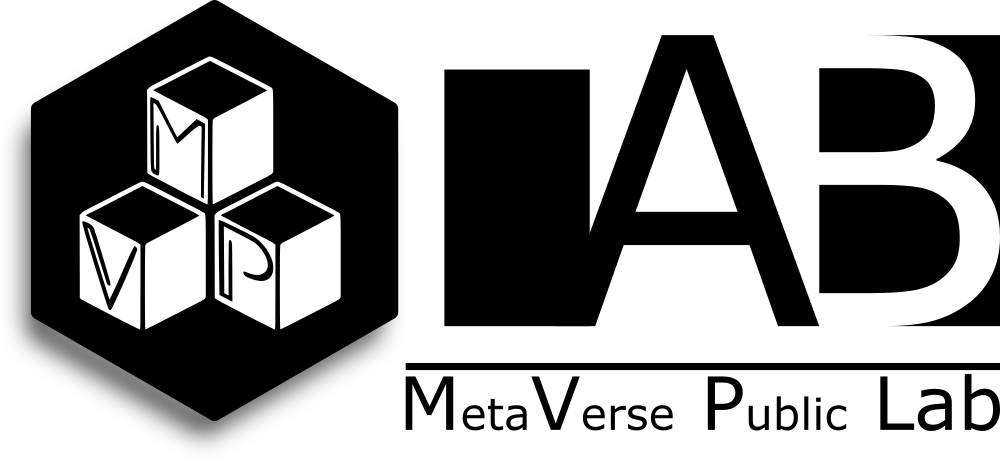
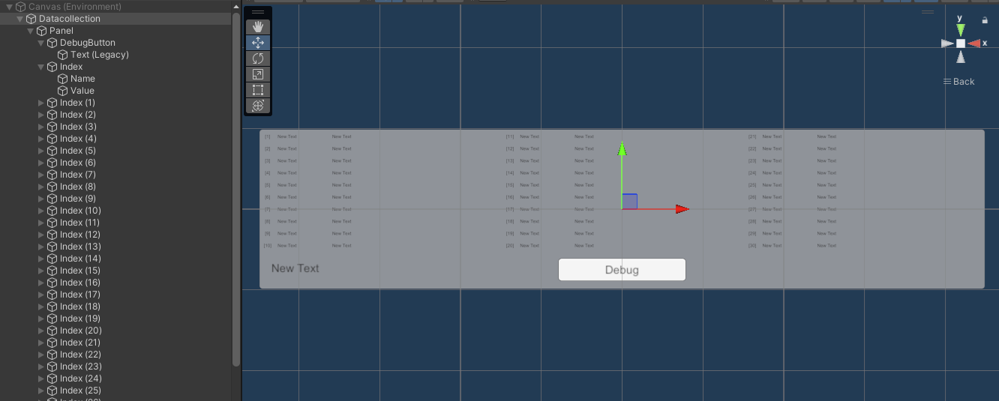
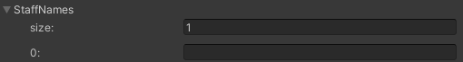
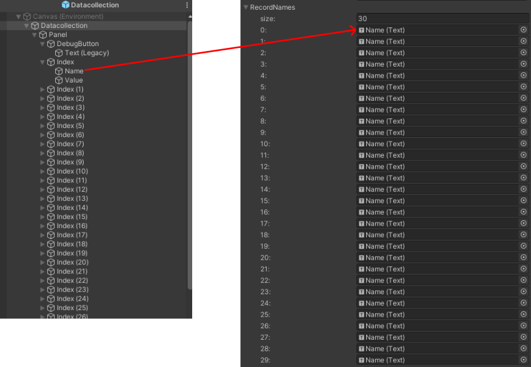

# MVP Lab
At Metaverse Public (MVP) Lab, we view the metaverse as a society and conduct research on interesting phenomena occurring there. We also aim to establish research methods suitable for the metaverse.

# MVP_DTC
Data collection system by MVP Lab

# Requirement
VRChat SDK Ver. 3.6.1 or later
Unity 2022.3.22f1

# How to use
## Prefab set
1. Clone or download this repository.
2. Import the contents of this repository into your Unity project.
3. Put the "Datacollection.prefab" to hierarchy.

## UDON Behaviour
1. Set some VRChat IDs to "Staffnames".
2. Enter the Name (Text) under the Index corresponding to the number of players you want to record in "RecordNames".

# Reference
[VRChat内位置情報・アンケート収集解析ツールYAIBAの紹介](https://note.com/cocu_tan/n/n70972d7646bd)
 
[YAIBA-VRC](https://note.com/cocu_tan/n/n70972d7646bd)

# Acknowledgement
This project was supported by MVP Lab.
