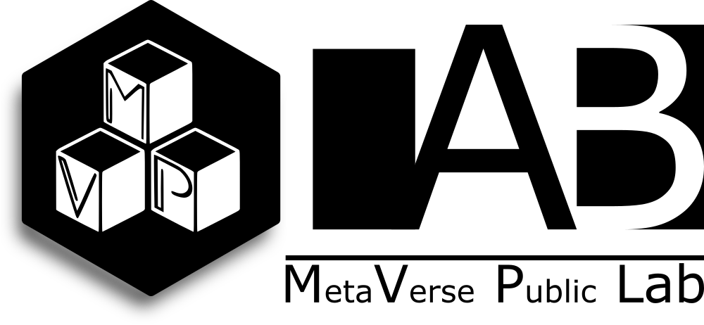
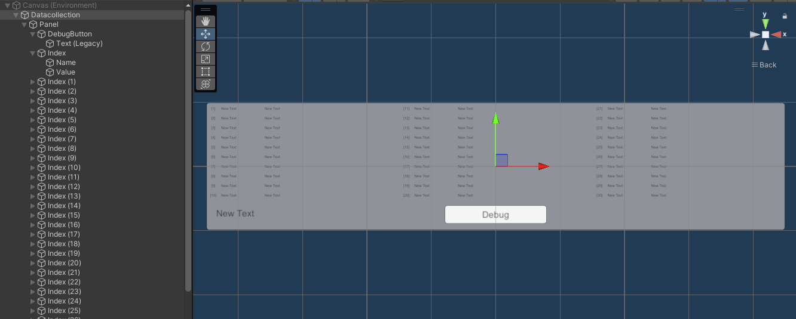
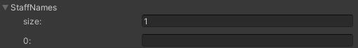
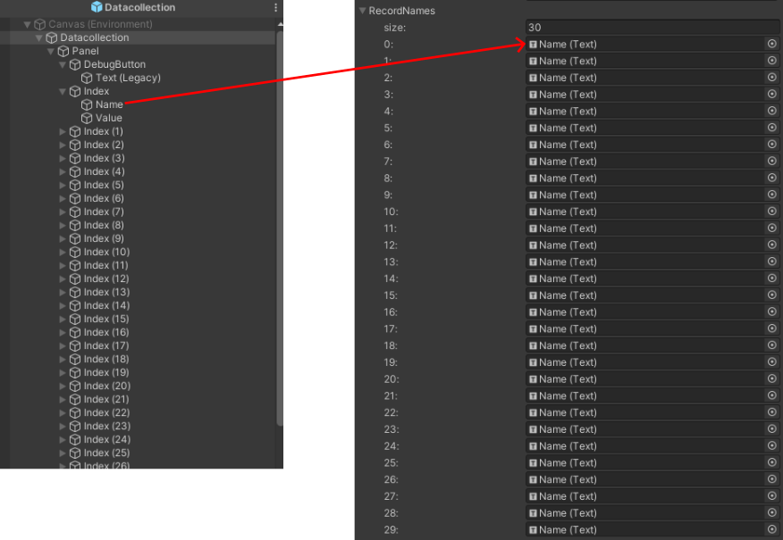
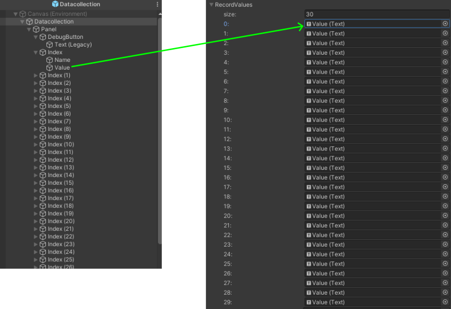
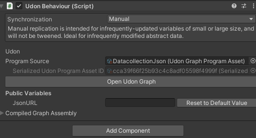
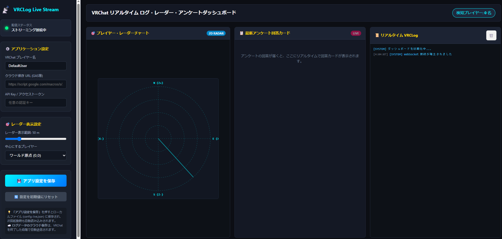
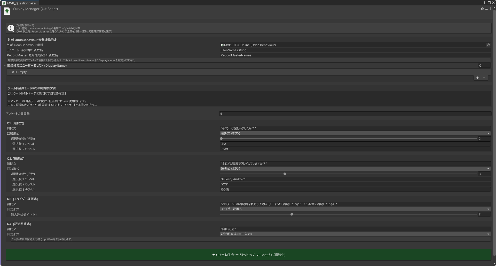

# MVP Lab - Data Collection & Survey System for VRChat

[日本語 (Japanese)](#-日本語-japanese) | [English](#-english)

---

# 🇯🇵 日本語 (Japanese)

## MVP Lab について
Metaverse Public (MVP) Lab では、メタバースをひとつの社会として捉え、そこで生じる様々な現象についての学術研究や調査を行っています。また、メタバース環境に適した新たな研究・データ収集手法の確立を目指しています。



## システム概要
**MVP_DTC (Data Collection System)** は、VRChat などのVR環境向けに開発された総合データ収集・管理システムです。  
**アバターの位置・頭部姿勢データの収集およびセキュアなクラウド同期**と、**ワールド内インタラクティブ・アンケートシステム**を統合し、実験・学術調査・イベントでのデータ取得を強力に支援します。

---

### 🚀 モジュール一覧
用途に合わせて利用可能な3つのコアモジュールで構成されています：

| モジュール | 概要 |
| :--- | :--- |
| **`MVP_DTC`** | ローカルの VRChat ログからアバターの空間移動・頭部姿勢トラッキングデータを抽出・記録します。 |
| **`MVP_DTC_Online`** | リアルタイム2Dレーダーや回答カードを表示するローカルWebダッシュボードと連携し、セッション終了時にクラウドへ自動保存します。 |
| **`MVP_Questionnaire`** | UdonSharpで構築されたワールド内対話型アンケートシステム。リアルタイム回答監視や柔軟な回答形式に対応します。 |

---

## 1. MVP_DTC (ローカル位置・姿勢データ収集)
VRChatワールド内に設置し、プレイヤーの移動座標や頭部回転ログを出力・保存する基本システムです。

### 動作環境
- VRChat SDK Ver. 3.6.1 以降
- Unity 2022.3.22f1



### 使い方
#### Prefabの配置
1. 本リポジトリをクローンまたはダウンロードします。
2. Unityプロジェクトに本リポジトリの内容をインポートします。
3. `Assets/MVP_DTC/Prefabs/MVP_DTC.prefab` をヒエラルキーに配置します。

#### UDON Behaviour (Datacollection) の設定
1. **`Staffnames`**: 記録・管理を行うスタッフの VRChat ID（DisplayName）を設定します。
2. **`RecordNames`**: 記録対象とするプレイヤー数に応じた Index の Name (Text) を設定します（最大30名）。
3. **`RecordValues`**: 記録対象とするプレイヤー数に応じた Index の Value (Text) を設定します（最大30名）。
4. **`AgreeButton`**: 参加者が同意を行うためのボタンUIを設定します。
5. ボタンUIの On Click イベントに、Datacollection UDON Behaviour の `RecordAgree` イベントを設定します。





#### その他の主要変数
| 変数名 | 型 | 用途 | デフォルト値 |
| :--- | :--- | :--- | :--- |
| **OwnerObject** | GameObject | Datacollection UDON Behaviour が設定されているオブジェクト | Datacollection |
| **AgreeButton** | UIButton | 同意を確認するためのボタンUI | AgreeButton |
| **IndexText** | UIText | 現在記録対象となっているプレイヤー数を表示するテキスト | CurrentNumber |
| **MainCanvas** | Canvas | Datacollection デバッグ表示用キャンバス | Datacollection |
| **ButtonASource** | AudioSource | 同意ボタン押下時に再生されるSE音源 | Agreement |

#### ログの出力先
デフォルト設定では、Windowsのユーザーフォルダ配下の VRChat ログに出力されます：  
`C:\Users\[ユーザー名]\AppData\LocalLow\VRChat\VRChat`

デフォルトのログ出力フォーマット：
```text
[VRChat ID]: [Index]: [Head angular (yaw, pitch roll)] : [Avatar angular (yaw, pitch roll)] : [Avatar position]: [mm/dd/yyyy HH:MM:SS: milisec]
```

---

## 2. 📡 MVP_DTC_Online (クラウド連携 ＆ リアルタイムWebダッシュボード)
`MVP_DTC_Online` は、ローカルWebダッシュボードアプリケーション（`VRCLogLiveWebStream`）と連携し、プレイヤーの移動状況をリアルタイムな2Dレーダー上に可視化するとともに、セッション終了時にログデータを指定のクラウド（Google スプレッドシート / GAS 等）へ自動送信・バックアップします。

### 外部サーバー設定 (JSON連携)
MVP_DTC_Online は、外部Webサーバー等に設置した JSON ファイルから記録対象者（`PlayerNames`）およびスタッフ名（`StaffNames`）を動的に取得できます。特定プレイヤーのみを自動記録したい場合に便利です。

JSON フォーマット例：
```json
{
  "PlayerNames": [
    "NAME1",
    "NAME2",
    "NAME3",
    "NAME4"
  ],
  "StaffNames": [
    "StaffName1",
    "StaffName2"
  ]
}
```

### Prefabの配置
1. `Assets/MVP_DTC/Prefabs/MVP_DTC_Online.prefab` をヒエラルキーに配置します。
2. UDON Behaviour (`Datacollection_Json`) の **`JsonURL`** に、上記 JSON を返す外部サーバーのURLを設定します。



### 🌟 主な機能
- 🎯 **リアルタイム2Dレーダー**: ワールド内のプレイヤー座標を取得し、ブラウザ上の2Dレーダーにリアルタイム描画。
- 📋 **ライブアンケートカード**: VRChat内でアンケートに回答した参加者の回答結果を即座にダッシュボードにカード表示。
- ☁️ **クラウド自動アップロード**: VRChat終了時、収集した移動ログおよびアンケート結果を指定Webhook（Google Apps Script等）に自動POST送信。
- 🎥 **低遅延映像ストリーミング（HLS）**: MediaMTX・FFmpeg と連動し、現場映像をダッシュボード上でリアルタイムモニタリング可能。

### 🚀 セットアップと使用手順
#### Step 1: アプリケーションのダウンロード
1. リポジトリ内の `VRCLogLiveWebStream.zip`（または最新リリース）をダウンロードします。
2. 任意のフォルダに展開します。

#### Step 2: アプリケーションの起動
1. `VRCLogLiveWebStream.exe` をダブルクリックして起動します。
2. ※ 初回起動時、FFmpeg や MediaMTX が検出されない場合は自動ダウンロードが行われます（進捗はコマンドプロンプトに表示されます）。

#### Step 3: Webダッシュボードの設定
1. ブラウザで `http://localhost:5000` にアクセスします。
2. 左サイドバーで以下の項目を設定します：



| 項目名 | 画面上の位置 | 入力内容 | 説明・用途 |
| :--- | :--- | :--- | :--- |
| **VRChat プレイヤー名** | アプリ設定 | あなたの VRChat 表示名（例: `Sakurada`） | 記録ログおよびクラウド送信データ内でホストを識別するために使用 |
| **クラウド保存 URL** | アプリ設定 | 送信先 Webhook URL（例: Google Apps Script WebアプリURL） | VRChat終了時にログデータが自動POSTされる送信先 |
| **API Key / アクセストークン** | アプリ設定 | 認証トークン（任意） | 外部サーバー側で認証を行う場合に付与 |
| **レーダー表示範囲** | レーダー表示設定 | スライダー (10m ～ 200m、初期値: `50m`) | 2Dレーダーの表示縮尺・半径を調整 |
| **中心にするプレイヤー** | レーダー表示設定 | ドロップダウン（ワールド原点 `(0,0)` または検出プレイヤー） | レーダーの中心となる基準点を指定 |

3. **設定の保存**: 「💾 アプリ設定を保存」をクリックすると `config-live.json` に保存され、次回以降自動ロードされます。

#### Step 4: データ収集の流れ
1. VRChat 起動中、`VRCLogLiveWebStream.exe` をバックグラウンドで起動しておきます。
2. 2Dレーダーやアンケート回答カードでリアルタイムに進捗をモニタリングします。
3. VRChat を終了すると、セッションログが集計され自動的にクラウドエンドポイントへ送信されます。

### 📝 出力ログフォーマット
```text
[MVP_DTC] PlayerName: [ID]: (X, Y, Z): (Pitch, Yaw, Roll): (Vx, Vy, Vz): MM/DD/YYYY HH:mm:ss: Milliseconds
```

---

## 3. MVP_Questionnaire (ワールド内アンケートシステム)
`MVP_Questionnaire` は、UdonSharp (SDK3) で動作する高機能なワールド内アンケートシステムです。主催者はワールド内からワンクリックでアンケートを一斉配信し、リアルタイムに回答状況を管理できます。



### 🌟 主な機能
#### ① 3つの回答形式に対応
- **選択式 (Choice)**: 2択（はい/いいえ）から最大6択の押しやすいボタン形式。
- **スライダー評価式 (Rating)**: 1〜N段階（例: 5段階満足度評価）のスライダーバー形式。
- **記述回答式 (Text Input)**: VRChat内蔵キーボードを利用した自由記述入力（`InputField`）。

#### ② 2つの同意・配信対象モード (コントロールパネルで即時切替可能)
- **🎯 事前リスト方式 (事前同意連携 / `JsonNamesString`)**:
  - Googleフォームや外部登録等で事前にアンケート参加・データ利用の同意を得たプレイヤー（`JsonNamesString`）のみを対象として配信。
  - 事前に同意済みであるため、ワールド内での**同意確認画面はスキップ**され、即座に質問1から開始されます。
- **🌐 ワールド全員方式 (インワールド同意確認画面)**:
  - 事前リストを持たない場合や、パブリックイベント等で**インスタンス内の全員**（`RecordMaster` スタッフを除く）を対象に配信。
  - アンケート開始時に**同意確認画面（同意する／同意しない）**が必ず表示され、参加者の同意意思をその場で取得します。

#### ③ 主催者専用マスターコントロールパネル (`RecordMaster`)
イベント主催者・管理者（`RecordMaster`）のみに操作パネルが表示されます：
- **リアルタイム回答進捗**: 全体回答率、回答完了者一覧、未回答者一覧、途中退室者一覧を即時表示。
- **📋 未回答者への再表示**: ウィンドウを閉じてしまった参加者や、途中入室者に対してワンクリックで再通知。
- **🔄 アンケートリセット**: 次のセッションに向けて即座にステータスを初期化。
- **安全ロック機構**: アンケート配信中は誤操作防止のためモード切替をロック。有効な回答対象者が0名の場合は配信ボタンが無効化。

### 🛠️ セットアップ手順
1. `Assets/MVP_Questionnaire/UDON/UDONSharps/SurveyManager.cs` および `Editor/SurveyManagerEditor.cs` をプロジェクトにインポートします。
2. 設置したい Canvas オブジェクトに `SurveyManager` をアタッチします。
3. インスペクター上の **「★ Auto-Generate & Setup UI」** をクリックすると、質問パネル・同意確認画面・操作パネル・コンポーネントの関連付けが全自動で生成されます。
4. インスペクターで質問文（`questionTexts`）、形式（`answerTypes`）、選択肢（`optionLabels`）を自由にカスタマイズします。

### 📝 出力ログフォーマット
```text
[MVP_Q] PlayerName: Q1: イベントは楽しめましたか？: 選択式: はい | Q2: 満足度: スライダー評価式: 5 | Q3: ご意見: 記述回答式: 大変有意義でした！
```

---

## 4. ⚖️【重要】データ収集における同意取得と記録方法の違い

研究倫理やプライバシーに配慮したデータ収集を行うため、本システムでは**アンケート（`MVP_Questionnaire`）**および**位置・姿勢ログ（`MVP_DTC`）**の双方において、**「事前リスト方式（事前同意連携）」**と**「ワールド全員方式（インワールドその場での同意確認）」**という2つの記録アプローチを提供しています。

### (1) アンケート (`MVP_Questionnaire`) における同意取得と記録方法の違い

主催者コントロールパネル上またはインスペクターの初期設定で切り替え可能です：

```
[ 配信対象モードの選択 ]
 ( ) リスト限定モード (JsonNames)  ── 事前リスト方式（外部事前同意済み・即時開始）
 (*) ワールド全員モード (要同意確認) ── ワールド全員方式（インワールド同意画面・分岐処理）
```

#### ① 事前リスト方式（Google Forms等との外部事前同意連携）
- **仕組み**:
  1. 参加者が事前に Google Forms やWebフォーム等で「アンケートへの参加同意」および「VRChatアカウント名」を送信。
  2. 同意が確認されたプレイヤーのアカウント名一覧を JSON（GistやWebサーバー）または Udon変数（`JsonNamesString`）として連携。
  3. VRChat内では、リストに登録された事前同意済みプレイヤーのみを対象としてアンケートが配信されます。
- **記録方法と挙動**:
  - 事前に同意が完了しているため、ワールド内での**同意確認画面はスキップ**され、配信開始と同時に**直ちに質問1が表示**されます。
  - 回答完了時に `[MVP_Q]` ログとして記録・送信されます。

#### ② ワールド全員方式（インワールドその場での同意確認）
- **仕組み**:
  - 事前同意リストが存在しない場合や、一般参加者が集まるオープンイベントにおいて、インスタンス内の全プレイヤー（`RecordMaster` スタッフを除く）を対象にアンケートを一斉配信します。
- **記録方法と挙動**:
  - アンケート開始時、参加者の画面にまず**【アンケート参加・データ収集に関する同意確認画面】**が表示されます。
  - **「同意する」を押した場合**: 質問画面へと進み、全問回答後に `[MVP_Q]` ログとして記録されます。
  - **「同意しない」を押した場合**: アンケート画面が直ちに閉じられ、質問には進まず安全に終了します。管理者側の集計パネルでは「回答済み（辞退）」としてカウントされ、進捗が正確に管理されます。

#### 📊 アンケート同意方式の比較一覧
| 項目 | 🎯 事前リスト方式 (`JsonNamesString`) | 🌐 ワールド全員方式 (`All Instance Players`) |
| :--- | :--- | :--- |
| **対象プレイヤー** | 外部フォームで事前同意済みの登録プレイヤーのみ | インスタンス内にいる全プレイヤー（スタッフを除く） |
| **同意取得のタイミング** | **ワールド入室前**（Googleフォーム / Webフォーム等） | **アンケート配信開始時**（ワールド内ポップアップ） |
| **インワールド同意確認画面** | **スキップ**（表示されません） | **必ず表示**（「同意する」「同意しない」の2択） |
| **参加者の画面遷移** | 配信開始と同時に**問1から即座に開始** | ① 同意確認画面が表示される<br>② **「同意する」**: 問1へ進み回答<br>③ **「同意しない」**: 終了（回答せず閉じる） |
| **記録・集計の違い** | 事前同意リストのプレイヤーの回答のみ集計・記録 | ・同意者の回答データを `[MVP_Q]` ログとして記録<br>・辞退者も「回答済み（辞退）」として集計カウントされ、管理者画面で把握可能 |
| **最適な用途** | 事前承諾を得ている被験者実験・指定グループ調査 | 一般参加者が自由に入退出するパブリックイベント・集会・オープン調査 |

### (2) 位置・視線ログ (`MVP_DTC` / `MVP_DTC_Online`) における同意取得と記録方法の違い

アバターの移動・姿勢トラッキングでも、アンケートと同様に2つの同意・記録アプローチを用意しています：

#### ① 事前リスト登録方式 (`PlayerNames` / `StaffNames`)
- 外部サーバーの JSON（`PlayerNames`）や Udon 配列にあらかじめ同意済みプレイヤーIDを設定しておく方式。
- 対象プレイヤーが入室している間、ワールド内の同意UIに触れることなくバックグラウンドで自動的に高精度ログが記録されます。
- 事前にGoogleフォームや書面等で研究参加同意を取得している学術実験に最適です。

#### ② ワールド全員・その場での同意方式
- **単体版 (`MVP_DTC.prefab`)**:  
  ワールド内に設置された同意ボタン（`AgreeButton`）をプレイヤー自身がインタラクトして押すことで、同意フラグが立ち、追跡スロット（`RecordNames` / `RecordValues`）へ動的に登録されてログ記録が開始されます。
- **アンケート統合版 (`SurveyManager` 連動)**:  
  ワールド全員モードと連動し、参加者に位置・視線データ収集（MVP_DTC）の同意確認パネル（`Container_DtcConsent`）を提示します。
  - **「同意する」を押した場合**: ネットワーク同期変数（`syncedDtcConsentedPlayers`）に登録され、トラッキングデータ（`[MVP_DTC]`）の記録対象となります。
  - **「同意しない」を押した場合**: 辞退リスト（`syncedDtcDisagreedPlayers`）に登録され、トラッキング処理から完全に除外されます（データは一切記録されません）。
  - 同意・辞退の結果は、管理者のコンソールおよびログへ即座に通知されます：
    ```text
    ★ [MVP_DTC] PlayerName: 同意（データ記録対象に登録されました）
    ★ [MVP_DTC] PlayerName: 同意辞退（データ記録対象外）
    ```

---

## 参考文献
- [VRChat内位置情報・アンケート収集解析ツールYAIBAの紹介](https://note.com/cocu_tan/n/n70972d7646bd)
- [YAIBA-VRC](https://note.com/cocu_tan/n/n70972d7646bd)

## 謝辞
本プロジェクトは MVP Lab（Metaverse Public Lab）の支援により開発されました。

---
---

# 🇺🇸 English

## About MVP Lab
At Metaverse Public (MVP) Lab, we view the metaverse as a society and conduct research on interesting phenomena occurring there. We also aim to establish research methods and data collection frameworks uniquely suited for virtual environments.


## System Overview
**MVP_DTC (Data Collection System)** is a comprehensive data management suite engineered specifically for VRChat and virtual environments. It integrates **spatial movement & head tracking collection alongside secure cloud synchronization** with an **interactive in-world questionnaire survey system**, providing researchers and event hosts with robust experimental tools.

---

### 🚀 Modules Overview
This repository consists of three specialized core modules:

| Module | Description |
| :--- | :--- |
| **`MVP_DTC`** | Monitors local VRChat logs and extracts spatial movement & tracking data. |
| **`MVP_DTC_Online`** | Provides a local live web dashboard (2D radar visualizer & live survey cards) with automated cloud backup on session completion. |
| **`MVP_Questionnaire`** | Interactive in-world survey system built with UdonSharp (SDK3) for dynamic questionnaire deployment and real-time response monitoring. |

---

## 1. MVP_DTC (Local Movement & Tracking Collection)
The foundational data collection module that outputs avatar position, rotation, and tracking logs directly into local VRChat log files.

### Requirements
- VRChat SDK Ver. 3.6.1 or later
- Unity 2022.3.22f1


### How to Use
#### Prefab Setup
1. Clone or download this repository.
2. Import the package contents into your Unity project.
3. Place `Assets/MVP_DTC/Prefabs/MVP_DTC.prefab` into your scene hierarchy.

#### UDON Behaviour (Datacollection) Configuration
1. **`Staffnames`**: Enter the VRChat DisplayNames of designated experiment administrators/staff.
2. **`RecordNames`**: Enter the Name (Text) under the Index corresponding to the number of participants you want to track (maximum 30).
3. **`RecordValues`**: Enter the Value (Text) under the Index corresponding to the number of participants you want to track (maximum 30).
4. **`AgreeButton`**: Bind the consent confirmation UI Button.
5. In your Button UI's On Click event, register the `RecordAgree` event on the Datacollection UDON Behaviour.


#### Variable Reference
| Variable Name | Type | Description | Default |
| :--- | :--- | :--- | :--- |
| **OwnerObject** | GameObject | Target GameObject with the Datacollection UDON Behaviour attached | Datacollection |
| **AgreeButton** | UIButton | Button component used for confirming consent | AgreeButton |
| **IndexText** | UIText | UI Text displaying the current number of registered tracked players | CurrentNumber |
| **MainCanvas** | Canvas | Debug display canvas for Datacollection | Datacollection |
| **ButtonASource** | AudioSource | Sound effect audio source triggered when consent button is clicked | Agreement |

#### Log File Location & Format
By default, logs are written to the local VRChat AppData directory:  
`C:\Users\[USER NAME]\AppData\LocalLow\VRChat\VRChat`

Standard output structure:
```text
[VRChat ID]: [Index]: [Head angular (yaw, pitch roll)] : [Avatar angular (yaw, pitch roll)] : [Avatar position]: [mm/dd/yyyy HH:MM:SS: milisec]
```

---

## 2. 📡 MVP_DTC_Online (Cloud Sync & Live Web Dashboard)
`MVP_DTC_Online` extends local data collection by pairing it with a local web dashboard application (`VRCLogLiveWebStream`). It enables researchers to observe player movements on a real-time 2D radar, inspect live survey cards, and automatically upload aggregated session logs to cloud endpoints (such as Google Sheets via Google Apps Script) upon session termination.

### External Server Configuration (JSON)
`MVP_DTC_Online` can dynamically fetch pre-registered participant lists (`PlayerNames`) and staff credentials (`StaffNames`) from an external JSON URL:

```json
{
  "PlayerNames": [
    "NAME1",
    "NAME2",
    "NAME3",
    "NAME4"
  ],
  "StaffNames": [
    "StaffName1",
    "StaffName2"
  ]
}
```

### Prefab Setup
1. Place `Assets/MVP_DTC/Prefabs/MVP_DTC_Online.prefab` into your scene hierarchy.
2. In the UDON Behaviour (`Datacollection_Json`), set **`JsonURL`** to your external JSON endpoint URL.


### 🌟 Key Features
- 🎯 **Real-Time 2D Radar Visualizer**: Visualizes nearby player coordinates on an interactive 2D radar map in real time.
- 📋 **Live Questionnaire Cards**: Displays incoming survey responses instantly as participants complete surveys in VRChat.
- ☁️ **Automated Cloud Data Upload**: Securely uploads recorded movement logs and survey results to your specified cloud storage endpoint (e.g., Google Apps Script / Webhook) when VRChat is closed.
- 🎥 **Integrated HLS Video Streaming**: Automatically manages MediaMTX and FFmpeg dependencies to provide low-latency live video streaming directly within the dashboard.

### 🚀 Setup & Usage Instructions
#### Step 1: Download & Extraction
1. Download `VRCLogLiveWebStream.zip` from the latest release or repository folder.
2. Extract the archive to any directory on your local machine.

#### Step 2: Launch Application
1. Double-click `VRCLogLiveWebStream.exe` to launch.
2. **First-Time Dependency Download**: If FFmpeg or MediaMTX are not detected, the application will automatically download them (download progress is displayed in the console window).

#### Step 3: Web Dashboard Configuration
1. Open your web browser and navigate to: `http://localhost:5000`
2. Configure settings in the left sidebar:


| Field Name | Location in App | What to Enter | Description & Purpose |
| :--- | :--- | :--- | :--- |
| **VRChat Player Name** | Application Settings | Your VRChat DisplayName *(e.g., `Sakurada`)* | Identifies host log entries in data records and cloud payloads |
| **Cloud Storage URL** | Application Settings | Webhook Endpoint URL *(e.g., Google Apps Script URL)* | Destination URL where logs are automatically POSTed when VRChat is closed |
| **API Key / Access Token** | Application Settings | Secret Token / Password *(Optional)* | Included with HTTP payloads for server-side authorization |
| **Radar Display Range** | Radar Display Settings | Slider *(10m – 200m, Default: `50m`)* | Adjusts visual radius and zoom scale of the 2D radar map |
| **Center Player** | Radar Display Settings | Dropdown *(World Origin `(0,0)` or detected player)* | Sets coordinate anchor point for radar visualization |

3. Click **💾 Save Application Settings** to store credentials in `config-live.json`.

#### Step 4: Data Collection Workflow
1. Keep `VRCLogLiveWebStream.exe` running in the background during your VRChat session.
2. Monitor player tracking and incoming responses in real time.
3. When VRChat is closed, logs are automatically consolidated and uploaded to your cloud endpoint.

### 📝 Output Log Format
```text
[MVP_DTC] PlayerName: [ID]: (X, Y, Z): (Pitch, Yaw, Roll): (Vx, Vy, Vz): MM/DD/YYYY HH:mm:ss: Milliseconds
```

---

## 3. MVP_Questionnaire (In-World Survey System)
`MVP_Questionnaire` is an automated in-world survey system built on UdonSharp (SDK3). It provides event organizers and researchers with full control over in-world survey distribution, response tracking, and structured logging.


### 🌟 Key Features
#### ① 3 Question Formats
- **Multiple Choice**: Push-button selection from 2 options (Yes/No) up to 6 choices.
- **Rating Slider**: 1-to-N point Likert/satisfaction evaluation slider.
- **Text Input**: Open-ended text response using the native VRChat virtual keyboard (`InputField`).

#### ② Dual Consent & Distribution Modes (Toggleable via Control Panel)
- **🎯 Pre-registered List Mode (Prior Consent Linkage / `JsonNamesString`)**:
  - Broadcasts exclusively to participants who provided prior consent and registration (via Google Forms or external websites) linked through `JsonNamesString` or an external JSON URL.
  - Since consent is verified beforehand, the **in-world consent screen is skipped**, and Question 1 begins immediately.
- **🌐 All Instance Players Mode (In-World Consent Dialog)**:
  - Broadcasts to **all players currently in the instance** (excluding `RecordMaster` staff) for open sessions without pre-registration.
  - An **in-world consent confirmation dialog ("Agree" / "Disagree")** is mandatory at the beginning, confirming willingness to participate on the spot.

#### ③ Master Control Panel for Administrators (`RecordMaster`)
A specialized control panel interface accessible only by authorized hosts (`RecordMaster`):
- **Real-Time Progress Monitoring**: Live response percentage, respondent breakdown (completed, pending, departed).
- **📋 Re-display to Unanswered Players**: One-click prompt re-triggering for users who accidentally closed their dialog or joined late.
- **🔄 Survey Reset**: Instantly resets survey state for recurring sessions.
- **Safety Locks & Error Guards**: Prevents mode modifications while a survey is live; disables start trigger when 0 eligible participants are present.

### 🛠️ Setup & Usage
1. Place `SurveyManager.cs` and `Editor/SurveyManagerEditor.cs` into your project.
2. Attach `SurveyManager` to your target Canvas object.
3. Click **"★ Auto-Generate & Setup UI"** in the Inspector to automatically build all dialog panels, consent views, control interfaces, and event bindings.
4. Customize question strings (`questionTexts`), question types (`answerTypes`), and choice options (`optionLabels`) directly in the Inspector.

### 📝 Output Log Format
```text
[MVP_Q] PlayerName: Q1: Did you enjoy the event?: Choice: Yes | Q2: Satisfaction: Rating: 5 | Q3: Comments: Text: Great experience!
```

---

## 4. ⚖️【Key Feature】Consent Management & Data Collection Modes

To satisfy research ethics and user privacy requirements, MVP_DTC provides two distinct data collection strategies for both **questionnaire surveys (`MVP_Questionnaire`)** and **spatial movement tracking (`MVP_DTC`)**: **Pre-registered List Mode (Prior Consent Linkage)** and **All Instance Players Mode (In-World Consent Confirmation)**.

### (1) Survey Consent Modes (`MVP_Questionnaire`)

Administrators can select the target mode either in the Inspector or directly via the Master Control Panel:

```
[ Target Distribution Mode ]
 ( ) List-Restricted Mode (JsonNames) ── Pre-registered List Mode (Pre-consented; skips consent screen)
 (*) All Instance Players Mode       ── All Players Mode (Mandatory in-world consent dialog)
```

#### ① Pre-registered List Mode (External Prior Consent via Google Forms, etc.)
- **How It Works**:
  1. Participants submit prior consent along with their VRChat account name via Google Forms or external web questionnaires before joining the event.
  2. The approved participant list is exported to JSON (e.g., via GitHub Gist) or assigned directly to the `JsonNamesString` Udon variable.
  3. Inside VRChat, the survey is displayed only to these registered, pre-consented players.
- **Flow & Behavior**:
  - Because consent has already been obtained, the in-world **consent screen is completely skipped**, jumping straight to **Question 1**.
  - Upon submission, responses are logged in structured format as `[MVP_Q]` entries.

#### ② All Instance Players Mode (In-World On-the-Spot Consent)
- **How It Works**:
  - Broadcasts to all users in the instance (excluding `RecordMaster` staff) when no pre-registration list exists or for public community events.
- **Flow & Behavior**:
  - When the survey starts, participants are presented with an **in-world Consent Confirmation Screen** ("Agree" / "Disagree").
  - **Selecting "Agree"**: The player proceeds to Question 1 and answers the questionnaire; results are recorded as `[MVP_Q]` logs.
  - **Selecting "Disagree"**: The survey terminates cleanly and closes without showing questions. The administrator dashboard tallies them as "Declined" to maintain accurate progress tracking.

#### 📊 Survey Consent Comparison
| Feature | 🎯 Pre-registered List Mode (`JsonNamesString`) | 🌐 All Instance Players Mode (`All Instance Players`) |
| :--- | :--- | :--- |
| **Target Participants** | Only pre-consented players registered via external forms | All players currently in the instance (excluding staff) |
| **Consent Timing** | **Prior to world entry** (Google Forms / Web registration) | **At survey broadcast start** (In-world dialog popup) |
| **In-World Consent Screen** | **Skipped** (assumed pre-consented) | **Mandatory Prompt** ("Agree" / "Disagree" dialog) |
| **User Flow** | Starts **immediately at Question 1** | ① Consent screen appears first<br>② **"Agree"**: Proceeds to Question 1<br>③ **"Disagree"**: Survey closes immediately |
| **Logging & Tracking** | Only logs answers from pre-registered respondents | • Responses from consenting users recorded as `[MVP_Q]` logs<br>• Declining users are tracked as "Declined" in administrative metrics |
| **Recommended Use Case** | Controlled lab experiments with prior written consent | Public gatherings, community events, and open surveys |

### (2) Movement & Tracking Consent Modes (`MVP_DTC` / `MVP_DTC_Online`)

Tracking and position recording also mirror this two-tiered consent architecture:

#### ① Pre-registered Participant List (`PlayerNames` / `StaffNames`)
- Tracks only users specified in the external JSON configuration or Inspector array.
- When target players are present in the instance, spatial data is logged automatically in the background without requiring in-world button interaction.
- Ideal for formal research where consent is established before entering the world.

#### ② In-World Consent Confirmation
- **Standalone Prefab (`MVP_DTC.prefab`)**:  
  Players actively click the in-world `AgreeButton`. Upon interaction, the player is dynamically assigned to a tracking slot (`RecordNames` / `RecordValues`), initiating data logging.
- **Integrated Survey & DTC Consent (`SurveyManager`)**:  
  When running in "All Players Mode", an in-world DTC Consent prompt (`Container_DtcConsent`) is presented to participants:
  - **Clicking "Agree"**: The player's name is synchronized into `syncedDtcConsentedPlayers`, activating their movement tracking (`[MVP_DTC]`).
  - **Clicking "Disagree"**: The player's name is stored in `syncedDtcDisagreedPlayers`, strictly excluding them from tracking (no movement data is recorded).
  - Consent status changes are broadcasted and logged immediately:
    ```text
    ★ [MVP_DTC] PlayerName: 同意（データ記録対象に登録されました）
    ★ [MVP_DTC] PlayerName: 同意辞退（データ記録対象外）
    ```

---

## References
- [VRChat内位置情報・アンケート収集解析ツールYAIBAの紹介](https://note.com/cocu_tan/n/n70972d7646bd)
- [YAIBA-VRC](https://note.com/cocu_tan/n/n70972d7646bd)

## Acknowledgement
This project was supported by MVP Lab (Metaverse Public Lab).
